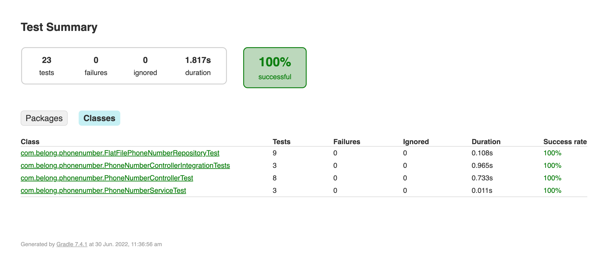

# phone-number-service

Framework/libraries used
- Java 11 
- SpringBoot 2.7.1 
- JUnit 5 
- Hamcrest 
- Gradle

Design decisions 
- Try to keep thing simple as possible
- More emphasis on API/ Rest interface layer
- Followed TDD as where ever possible
- Not all edge cases are covered to deliver this in timely manner

Notes:
- id and phoneNumberId represent the same and used inconsistently
- DTOs used across different layers since it is simple api
- Data are load from a flat file and not much emphasis given to repository implementation
- Service is barely empty, but keep that to separate controller and repository
- Not muh emphasis given to DTOs equal(), hashCode() and Serializable
- Logging can be improved

How to run:
Run spring boot service
`./gradlew bootRun`

Run tests
`./gradlew test`
Test coverage available [here](./build/reports/tests/test/index.html) after the test run

API specification available [here](./docs/phone-number-api-1.0.0-specifications.yaml)

